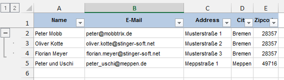

# GroupedBinding

To group data by a property (i.e. vertical outline) you have to define the corresponding column binding as a group-by-binding.

## Code
```php
<?php

...

$zipBinding = new ColumnBinding();
$zipBinding->setLabel('Zipcode');
$zipBinding->setBinding('zipcode');
$zipBinding->setColumnWidth('auto');
$sheet1->addColumnBinding($zipBinding);

//Group results by zip code
$sheet1->setGroupByBinding($zipBinding);

...

```

## Result

