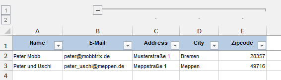

# Outlined Binding

The following example extends the [Simple Binding](SimpleBinding.md) example by adding more information (i.e. columns) to the excel file and groups them by specifying an outline for each additional binding.

## Code
```php
<?php

use StingerSoft\ExcelCreator\ConfiguredExcel;
use StingerSoft\ExcelCreator\ColumnBinding;

include __DIR__.'/../vendor/autoload.php';
include __DIR__.'/Person.php';

//Create excel file
$excel = new ConfiguredExcel();

//and a first sheet called 'Party guests'
$sheet1 = $excel->addSheet('Party guests');

//Add a column with the caption 'name'
$nameBinding = new ColumnBinding();
$nameBinding->setLabel('Name');

//bind it to the property of the data to be rendered by specifying the property path (see http://symfony.com/doc/current/components/property_access.html )
$nameBinding->setBinding('name');

//Width will be calculated by excel
$nameBinding->setColumnWidth('auto');
$sheet1->addColumnBinding($nameBinding);


//Add a column with the caption 'E-Mail'
$emailBinding = new ColumnBinding();
$emailBinding->setLabel('E-Mail');
$emailBinding->setBinding('email');
$emailBinding->setColumnWidth('auto');
$sheet1->addColumnBinding($emailBinding);

//Add other information in outline 1
$streetBinding = new ColumnBinding();
$streetBinding->setLabel('Address');
$streetBinding->setBinding('address');
$streetBinding->setColumnWidth('auto');
$streetBinding->setOutline(1);
$sheet1->addColumnBinding($streetBinding);

$cityBinding = new ColumnBinding();
$cityBinding->setLabel('City');
$cityBinding->setBinding('city');
$cityBinding->setColumnWidth('auto');
$cityBinding->setOutline(1);
$sheet1->addColumnBinding($cityBinding);

$zipBinding = new ColumnBinding();
$zipBinding->setLabel('Zipcode');
$zipBinding->setBinding('zipcode');
$zipBinding->setColumnWidth('auto');
$zipBinding->setOutline(1);
$sheet1->addColumnBinding($zipBinding);

$guests = array();

$person = new Person('Peter Mobb', 'peter@mobbtrix.de');
$person->setAddress('Musterstraße 1');
$person->setCity('Bremen');
$person->setZipCode(28357);
$guests[] = $person;

$person = new Person('Peter und Uschi', 'peter_uschi@meppen.de');
$person->setAddress('Meppstraße 1');
$person->setCity('Meppen');
$person->setZipCode(49716);
$guests[] = $person;

$sheet1->setData($guests);
$sheet1->applyData();

\PHPExcel_IOFactory::createWriter($excel->getPhpExcel(), 'Excel2007')->save(__DIR__.'/outline_binding.xlsx');

```

## Result

